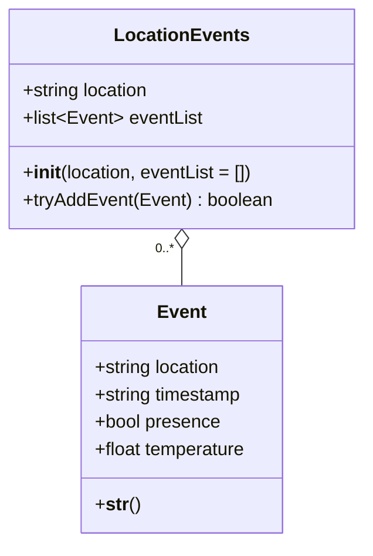
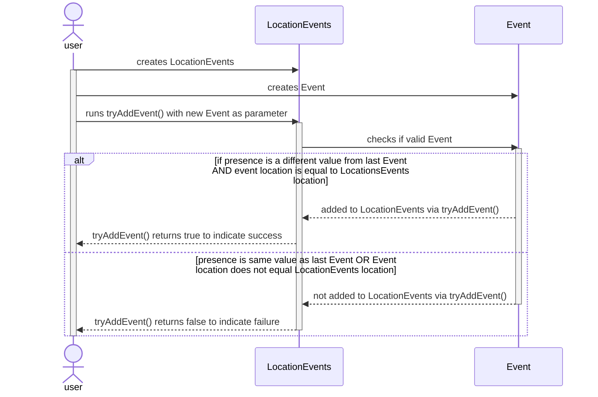

```mermaid
classDiagram
    class Event
    Event : +string location
    Event : +string timestamp
    Event : +bool presence
    Event : +float temperature
    Event : +__str__()
    class LocationEvents
    LocationEvents : +string location
    LocationEvents : +list~Event~ eventList
    LocationEvents : +__init__(location, eventList = [])
    LocationEvents "0..*" o-- Event
    LocationEvents : +tryAddEvent(Event) boolean
```

```mermaid
sequenceDiagram
    actor U as user
    participant L as LocationEvents
    participant E as Event
    U->>L: creates LocationEvents
    activate U
    U->>E: creates Event
    U->>L: runs tryAddEvent() with new Event as parameter
    activate L
    L->>E: checks if valid Event
    activate E
    alt if presence is a different value from last Event AND event location is equal to LocationsEvents location
    E-->>L: added to LocationEvents via tryAddEvent()
    L-->>U: tryAddEvent() returns true to indicate success
    else presence is same value as last Event OR Event location does not equal LocationEvents location
    E-->>L: not added to LocationEvents via tryAddEvent()
    deactivate E
    L-->>U: tryAddEvent() returns false to indicate failure
    deactivate L
    end
    deactivate U
```